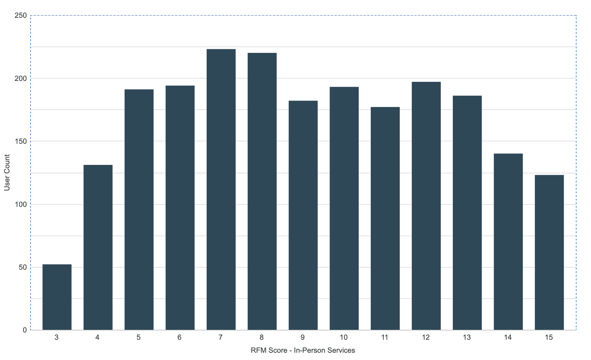
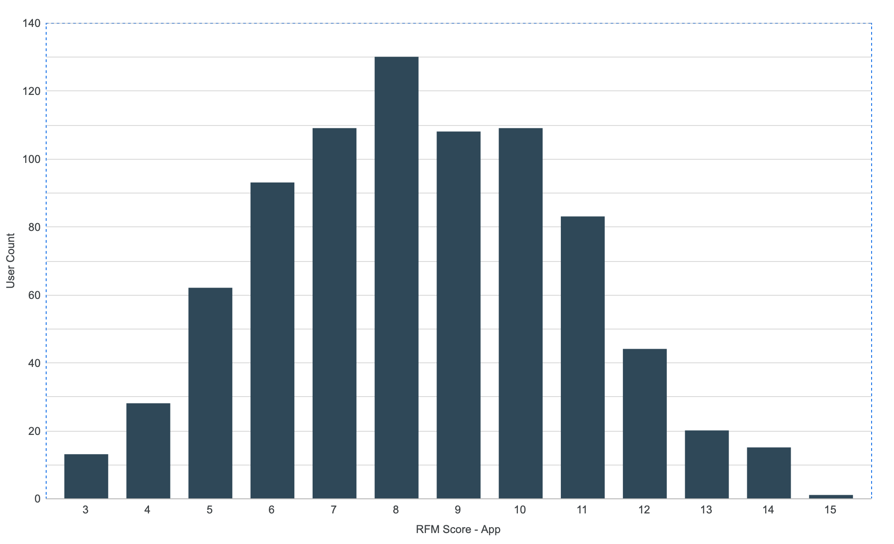
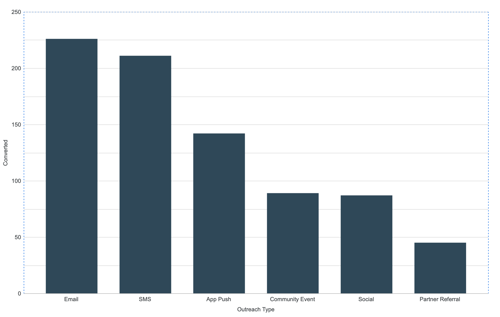

# Customer Retention, Churn Risk & Campaign Attribution Analytics

## Overview

This case study project analyzes user engagement, retention, and campaign performance for a social enterprise delivering preventive healthcare through a hybrid model of telehealth, a mobile app, and community outreach. Using BigQuery, I built RFM (Recency, Frequency, Monetary) segmentation, behavior-based churn risk flags, and outreach conversion analysis across five linked datasets to answer a concrete business question: **why are users dropping off, and how can this be addressed?**

---

## Skills & Tools

### Analytics
- RFM segmentation
- Churn risk modeling
- Campaign attribution analysis
- Customer behavior analysis
- Cross-segment analysis (age, income, region)

### SQL
- Advanced SQL (CTEs, window functions, ARRAY_AGG, percentile analysis)
- Data quality validation
- Multi-table joins and transformation logic

### Tools
- Google BigQuery (GoogleSQL)
- Google Looker Studio

---

## Business Problem

Healthcare engagement platform CareConnect Health partners with clinics, pharmacies, and telehealth providers to deliver health services through digital platforms and community-based outreach across Australia.  It is funded through a blend of employer subscriptions, pay-per-service telehealth, and grant-funded campaigns. An internal review flagged four persistent problems:

- Drop-off after initial onboarding (users register but don't return)
- Low adherence to preventive care (missed screenings, delayed follow-ups)
- Uneven campaign performance across regions and channels
- Balancing personalized engagement with privacy compliance around sensitive health data

The brief: explore the dataset, segment users meaningfully, quantify churn risk, evaluate which outreach channels actually convert, and turn all of it into concrete, data-backed recommendations.

---

## Project Outcomes

This analysis identified:

- High-risk churn segments by age, region, and income
- The retention advantage of multi-channel engagement
- Outreach channels with the highest conversion rates
- Mismatches between campaign delivery channels and service types
- Three targeted recommendations to improve retention and campaign effectiveness

---

## Dataset Summary

CareConnect Health's data spans 3,598 users across five linked tables:

1. CareConnect_Users.csv
2. Service_Records.csv
3. App_Usage.csv
4. Outreach_Campaigns.csv
5. Campaign_Response.csv

A data dictionary and sample datasets are available in the [`data`](data/) folder.

---

## Advanced SQL Techniques Demonstrated

| Technique | Applied In |
|---|---|
| Multi-stage CTEs | Throughout all queries |
| Window functions: `ROW_NUMBER()`, `LAG()`, `LEAD()`, `FIRST_VALUE()`, `NTH_VALUE()` | Churn sequencing & journey-stage analysis |
| `NTILE()` quintile scoring | RFM segmentation |
| `ARRAY_AGG()` with `STRUCT` | Compiling per-user ordered service history |
| `APPROX_QUANTILES()` | Percentile-based, personalized churn thresholds |
| `SAFE_DIVIDE()` | Division-safe rate/ratio calculations across RFM and attribution logic |
| Multi-condition `CASE` logic | User status classification, churn flag combination |

---

## Methodology

### RFM Segmentation — Built as Two Parallel Models

I built **two separate RFM models** — one from service records, one from app usage — because the Frequency measures different things:

| RFM Dimension | Service-Based | App-Based |
|---|---|---|
| Recency | Most recent service | Most recent app activity |
| Frequency | Number of services | Average session minutes |
| Monetary | Total service fee | Telehealth spend |

Each dimension was scored into quintiles (`NTILE(5)`) so users could be ranked 1 (lowest) to 5 (highest) independently across both models.





### Churn Risk — A Behavior-Based, Context-Aware Definition

Churn risk was defined **relative to each user's own historical service cadence**: a user's expected next-service window was calculated from the 75th percentile of their own historical inter-service gaps (`APPROX_QUANTILES`), using `LAG()`/`LEAD()` window functions to sequence each user's service history. A user "overdue" relative to their own pattern was flagged as at-risk. App-based churn used a 180-day inactivity threshold because app usage frequency data wasn't available to follow a cadence-based approach.

The final churn risk flag combined both signals:

| | Service + App | Service + App | Service + App | Service + App | Service only | Service only | App only | App only |
|---|---|---|---|---|---|---|---|---|
| Service Churn Risk | Yes | Yes | No | No | Yes | No | – | – |
| App Churn Risk | No | Yes | No | Yes | – | – | Yes | No |
| **Final Risk Flag** | **No** | **Yes** | **No** | **No** | **Yes** | **No** | **Yes** | **No** |

### Outreach & Campaign Conversion Analysis

Conversion was defined as a user completing their first service within 30 days of an outreach touchpoint, based on prior published research on push-notification adherence windows. Window functions prevented duplicate attribution across overlapping campaigns before conversions were analyzed by outreach type and cross-referenced against access channel and service type to identify where outreach and delivery channel were misaligned.




For the full phase-by-phase reasoning behind each modeling decision, see [`docs/methodology.md`](docs/methodology.md).

---

## Key Findings

- **Engagement is polarized, and app-only users are the biggest at-risk group by volume.** 61.4% of users are multi-channel (app + in-person services), 22.65% are app-only, 7.98% use in-person services without the app, and 7.98% are inactive. App adoption is lowest among 18-25 year-olds — a specific, addressable onboarding gap.
- **Multi-channel users are meaningfully more resilient.** They average 166 days between services vs. 211 for in-person-only users, alongside higher median service fees and more recent app activity — cross-channel engagement, not just raw activity, predicts retention.
- **Churn concentrates in specific, actionable segments.** The 26-41 age bracket carries the highest churn risk, with South/Middle-income (79 users), East/Middle-income (76), and North/Middle-income (73) the largest at-risk cohorts by volume — precise enough to target directly rather than running a blanket re-engagement campaign.
- **The highest-converting channels aren't the highest-volume ones.** SMS and Email drove the most total attributed conversions (210 and 226), but Partner Referral and Social had the highest conversion *rates* (8.38% and 8.80%) — a volume-vs-efficiency tradeoff that matters for budget allocation.
- **Outreach type and service type are frequently mismatched.** Vaccination and Preventive Screening campaigns converted best through App Push and Partner Referral, while Follow-up Appointments converted fastest via Email/SMS — meaning a single generic campaign strategy would have left conversions on the table.
- **All observed conversion rates sit below the external 3.90% benchmark** used for comparison, indicating genuine room for improvement in targeting and channel-service alignment.

---

## Business Recommendations

1. **Convert single-channel users into multi-channel users via in-app achievements.** Since multi-channel users show meaningfully stronger retention, onboarding should actively push service-only and app-only users toward the other channel — e.g. milestone badges tied to genuinely preventive actions (first telehealth booking, timely vaccination completion), rather than generic gamification.
2. **Realign outreach channel to service type**, based directly on observed conversion patterns: Email/SMS for follow-up appointments, App Push for vaccinations and preventive screenings. This addresses a documented mismatch between how campaigns are currently run and where they actually convert.
3. **Pilot ML-based churn prediction and AI-assisted scheduling — deliberately scoped and privacy-bounded.** The churn logic developed here provides a strong rules-based baseline; a supervised model could improve on it, but only alongside explicit privacy safeguards, transparency about model limitations, and bias monitoring given the sensitivity of health data.

---

## Repository Structure

```text
├── sql/
│   ├── 01_Data_Quality_Checks.sql
│   ├── 02_Regional_Engagement_Analysis.sql
│   ├── 03_Age_Segment_Analysis.sql
│   ├── 04_RFM_Model.sql
│   ├── 05_Churn_Model.sql
│   └── 06_Outreach_Attribution.sql
│
├── images/
│   ├── figure1_rfm_scores_service.png
│   ├── figure2_rfm_scores_app.png
│   ├── figure3_conversions_by_outreach_type.png
│   ├── figure4_conversion_rates.png
│   └── figure5_total_services_by_outreach_type.png
│
├── docs/
│   └── methodology.md          # Phase-by-phase technical deep-dive
│
├── data/
│   ├── data_dictionary.md
│   ├── app_usage_sample.csv
│   ├── campaign_response_sample.csv
│   ├── careconnect_users_sample.csv
│   ├── outreach_campaigns_sample.csv
│   └── service_records_sample.csv
│
└── README.md
```

---

## Limitations

- Remote users and high-income earners were underrepresented in the dataset, limiting how confidently patterns can be generalized for those subgroups.
- App usage data lacked a session-frequency field, which constrained the App RFM Frequency dimension to average session length rather than session count.
- Churn logic here is rules-based; testing whether a supervised ML model materially improves on it — with privacy and fairness safeguards built in from the start — is the natural next step (see Recommendation 3).

## Disclaimer

This project was completed as part of postgraduate Business Analytics coursework and uses a healthcare scenario with adapted customer data.
